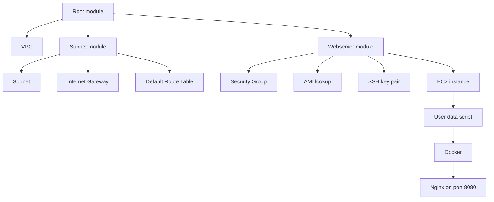
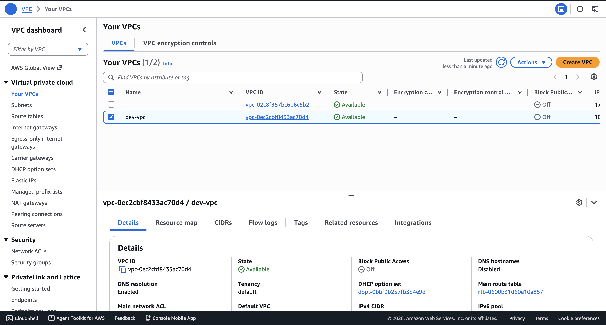
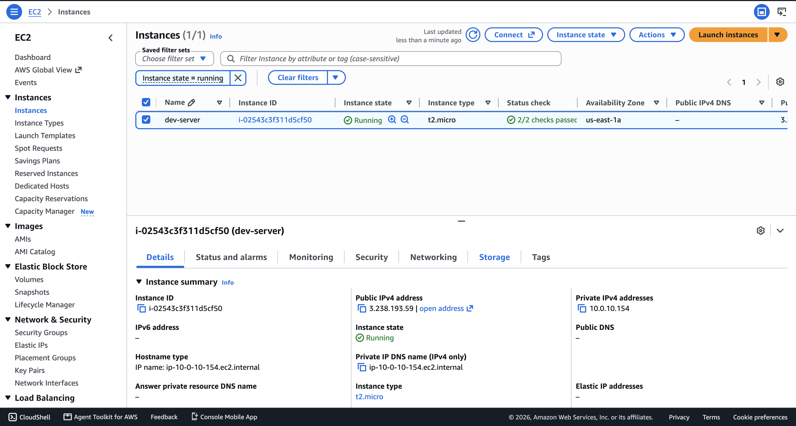
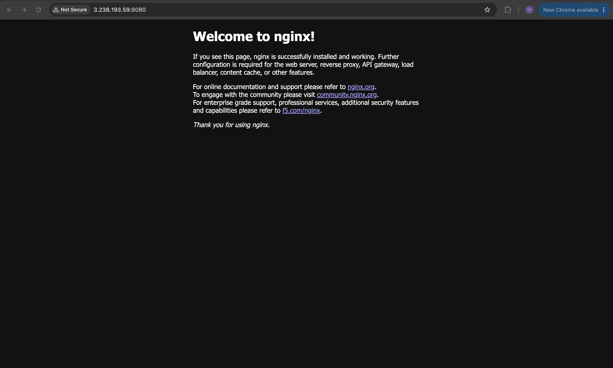

# Modularize Project with Terraform Modules

Terraform is an infrastructure as code tool that lets you build, change, and version cloud and on-prem resources safely and efficiently.

Terraform Modules are a collection of resources that Terraform manages together. When you repeatedly provision similar infrastructure, modules let you package the resources into reusable building blocks that can be called from a root module.

## Overview

This project demonstrates how to refactor an AWS infrastructure deployment into reusable Terraform modules. Instead of placing every resource in a single configuration file, the stack is split into a root module and child modules so the networking layer and compute layer can be reused independently.

The root configuration creates the VPC and then delegates the subnet and web server responsibilities to separate modules. This makes the codebase easier to maintain, easier to reason about, and easier to extend for other environments.

### Terraform key features

- Declarative provisioning: Terraform describes the desired infrastructure state, then calculates how to reach it.
- Module reuse: common resource groups can be packaged into child modules and reused across projects.
- Dependency awareness: Terraform builds a resource graph and handles resource ordering automatically.
- State tracking: Terraform stores infrastructure state so it can detect changes, manage drift, and avoid duplicate resources.
- Provider ecosystem: Terraform uses providers to interact with AWS and other platforms.
- Version-controlled workflows: infrastructure changes can be reviewed like application code.

## Demo Project

Automate AWS Infrastructure with Terraform

## Technologies used

- Terraform
- AWS
- Docker
- Linux
- Git

## Project Description

- Divide Terraform resources into reusable modules

## Repository structure

```text
modularize-project-with-terraform-modules/
├── README.md
├── NOTES.md
├── entry-script.sh
├── example.tfvars
├── main.tf
├── outputs.tf
├── providers.tf
├── variables.tf
├── images/
│   ├── dev-server-ec2-instance-console.png
│   ├── dev-vpc-console.png
│   └── nginx-deployed-browser.png
└── modules/
    ├── subnet/
    │   ├── main.tf
    │   ├── outputs.tf
    │   ├── providers.tf
    │   └── variables.tf
    └── webserver/
        ├── main.tf
        ├── outputs.tf
        ├── providers.tf
        └── variables.tf
```

### File responsibilities

- `main.tf`: defines the root module and creates the VPC, then calls the child modules.
- `variables.tf`: declares the input values used by the root module.
- `outputs.tf`: exports the EC2 public IP from the web server module.
- `providers.tf`: pins the AWS provider version.
- `modules/subnet`: provisions the subnet, internet gateway, and route table.
- `modules/webserver`: provisions the security group, AMI lookup, key pair, and EC2 instance.
- `entry-script.sh`: installs Docker on the instance and starts the Nginx container.
- `example.tfvars`: stores the sample environment-specific values passed into the Terraform configuration rename to `terraform.tfvars` and update it's values.
- `images/`: contains the AWS console, terminal, and browser screenshots used in this documentation.

## Architecture overview

This project follows a root-module plus child-module layout:



The root module owns the shared network boundary and passes values into the child modules. The subnet module is responsible for public networking resources, while the webserver module handles the security group, key pair, AMI selection, and EC2 instance provisioning.

### Designed components

- VPC: the isolated AWS network used by the application stack.
- Subnet module: creates the public subnet that hosts the EC2 instance.
- Internet gateway: provides internet access for the VPC.
- Route table: routes default traffic to the internet gateway.
- Webserver module: provisions the application host and its security controls.
- Security group: allows SSH from the operator IP and HTTP access on port 8080.
- EC2 instance: runs the Dockerized Nginx container.
- User data bootstrap: installs Docker and launches the container automatically at boot.

## Implementation Guide

### 1. Prerequisites

Before you begin, make sure the following are available:

- An AWS account with permission to create VPC, subnet, route table, security group, key pair, and EC2 resources.
- Terraform installed locally.
- AWS credentials configured on the workstation.
- A valid SSH public key file available locally.
- A public IP address for SSH access.

#### Install Terraform on macOS

The official Terraform installation documentation can be found here: https://developer.hashicorp.com/terraform/downloads

```sh
brew tap hashicorp/tap
brew install hashicorp/tap/terraform
```

#### Configure AWS credentials

```sh
aws configure
```

#### Create an SSH key pair

```sh
ssh-keygen -t rsa -b 4096
```

The public key path is referenced by `public_key_location` in `terraform.tfvars`.

#### Review the module inputs

The sample variable file is [example.tfvars](example.tfvars):

```hcl
# Update these values to match your AWS setup and workstation IP
vpc_cidr_block     = "10.0.0.0/16"
subnet_cidr_block  = "10.0.10.0/24"
avail_zone         = "us-east-1a"
env_prefix         = "dev"
my_ip              = "YOUR_IP/32"
instance_type      = "t2.micro"
public_key_location = "PATH_TO_PUB_KEY"
image_name        = "amzn2-ami-kernel-*-x86_64-gp2"
```

These values are loaded automatically from `terraform.tfvars` during deployment.

#### Initialize Terraform

```sh
terraform init
```

This downloads the AWS provider and prepares the working directory for the root module and its child modules.

### 2. Understand the module layout

The root configuration in [main.tf](main.tf) wires the project together:

```hcl
provider "aws" {
  region = "us-east-1"
}

resource "aws_vpc" "myapp-vpc" {
  cidr_block = var.vpc_cidr_block
  tags = {
    Name: "${var.env_prefix}-vpc"
  }
}

module "myapp-subnet" {
  source = "./modules/subnet"
  subnet_cidr_block = var.subnet_cidr_block
  avail_zone = var.avail_zone
  env_prefix = var.env_prefix
  vpc_id = aws_vpc.myapp-vpc.id
  default_route_table_id = aws_vpc.myapp-vpc.default_route_table_id
}

module "myapp-server" {
  source = "./modules/webserver"
  vpc_id = aws_vpc.myapp-vpc.id
  my_ip = var.my_ip
  env_prefix = var.env_prefix
  image_name = var.image_name
  public_key_location = var.public_key_location
  instance_type = var.instance_type
  subnet_id = module.myapp-subnet.subnet.id
  avail_zone = var.avail_zone
}
```

The child module contracts are defined through their input variables and outputs:

- `modules/subnet` accepts the VPC ID, subnet CIDR block, availability zone, route table ID, and environment prefix.
- `modules/webserver` accepts the VPC ID, operator IP, AMI image name, public key path, instance type, subnet ID, availability zone, and environment prefix.
- `modules/subnet` exports the created subnet so the root module can pass it to the server module.
- `modules/webserver` exports the EC2 instance so the root module can publish the public IP.

### 3. Provision the networking module

The subnet module groups the network resources that should always be created together:

```hcl
resource "aws_subnet" "myapp-subnet-1" {
  vpc_id = var.vpc_id
  cidr_block = var.subnet_cidr_block
  availability_zone = var.avail_zone
    tags = {
    Name: "${var.env_prefix}-subnet-1"
  }
}

resource "aws_internet_gateway" "myapp-igw" {
  vpc_id = var.vpc_id
  tags = {
    Name: "${var.env_prefix}-igw"
  }
}

resource "aws_default_route_table" "main-rtb" {
  default_route_table_id = var.default_route_table_id

  route {
    cidr_block = "0.0.0.0/0"
    gateway_id = aws_internet_gateway.myapp-igw.id
  }
  tags = {
    Name: "${var.env_prefix}-main-rtb"
  }
}
```

This module keeps the public networking logic isolated from the compute logic, which is the main benefit of modularization.

### 4. Provision the webserver module

The webserver module handles the compute and access controls:

```hcl
resource "aws_default_security_group" "default-sg" {
  vpc_id = var.vpc_id

  ingress {
    from_port = 22
    to_port = 22
    protocol = "TCP"
    cidr_blocks = [var.my_ip]
  }

  ingress {
    from_port = 8080
    to_port = 8080
    protocol = "TCP"
    cidr_blocks = ["0.0.0.0/0"]
  }

  egress {
    from_port = 0
    to_port = 0
    protocol = "-1"
    cidr_blocks = ["0.0.0.0/0"]
    prefix_list_ids = []
  }

  tags = {
    Name: "${var.env_prefix}-default-sg"
  }
}

resource "aws_key_pair" "ssh-key" {
  key_name = "server-key"
  public_key = file(var.public_key_location)
}

data "aws_ami" "latest-amazon-linux-image" {
  most_recent = true
  owners = ["amazon"]
  filter {
    name = "name"
    values = [var.image_name]
  }
  filter {
    name = "virtualization-type"
    values = ["hvm"]
  }
}

resource "aws_instance" "myapp-server" {
  ami = data.aws_ami.latest-amazon-linux-image.id
  instance_type = var.instance_type

  subnet_id = var.subnet_id
  vpc_security_group_ids = [aws_default_security_group.default-sg.id]
  availability_zone = var.avail_zone

  associate_public_ip_address = true
  key_name = aws_key_pair.ssh-key.key_name

  user_data = file("entry-script.sh")
  user_data_replace_on_change = true

  tags = {
    Name: "${var.env_prefix}-server"
  }
}
```

The `user_data` script installs Docker and launches Nginx on port 8080:

```bash
#!/bin/bash
sudo yum update -y && sudo yum install -y docker
sudo systemctl start docker
sudo usermod -aG docker ec2-user
docker run -p 8080:80 nginx
```

### 5. Review the deployment workflow

Use the standard Terraform workflow from the notes file:

```sh
terraform init
terraform plan
terraform apply
terraform destroy
```

The other useful commands from the notes are:

```sh
terraform state
terraform state list
terraform state show myapp-subnet-1
```

Terraform keeps the resource graph and state aligned with the configuration, so repeated runs remain safe and predictable.

### 6. Validate the deployed environment

After `terraform apply`, verify the result in both AWS and the browser.

Example access flow:

```sh
ssh -i ~/.ssh/id_rsa ec2-user@<PUBLIC_IP>
```

Then open the app in the browser:

```text
http://<PUBLIC_IP>:8080
```

#### AWS console screenshots





#### Browser screenshot



## Key lessons learned

- Modules are the cleanest way to group infrastructure that should be reused together.
- Passing values through variables keeps the root module small and focused on orchestration.
- Outputs are important for connecting modules together, especially when one module depends on another module's resource.

## Final result

The finished project provisions a complete AWS environment using reusable Terraform modules. The root module creates the shared VPC, the subnet module builds the public networking layer, and the webserver module launches the EC2 host with the required security controls and startup automation.

## References

- Terraform overview: https://developer.hashicorp.com/terraform/intro
- Terraform modules documentation: https://developer.hashicorp.com/terraform/language/modules
- Terraform AWS provider: https://registry.terraform.io/providers/hashicorp/aws/latest/docs
- Terraform variables: https://developer.hashicorp.com/terraform/language/values/variables
- AWS EC2 documentation: https://docs.aws.amazon.com/AWSEC2/latest/UserGuide/concepts.html
- AWS VPC documentation: https://docs.aws.amazon.com/vpc/latest/userguide/what-is-amazon-vpc.html
- Docker documentation: https://docs.docker.com/
